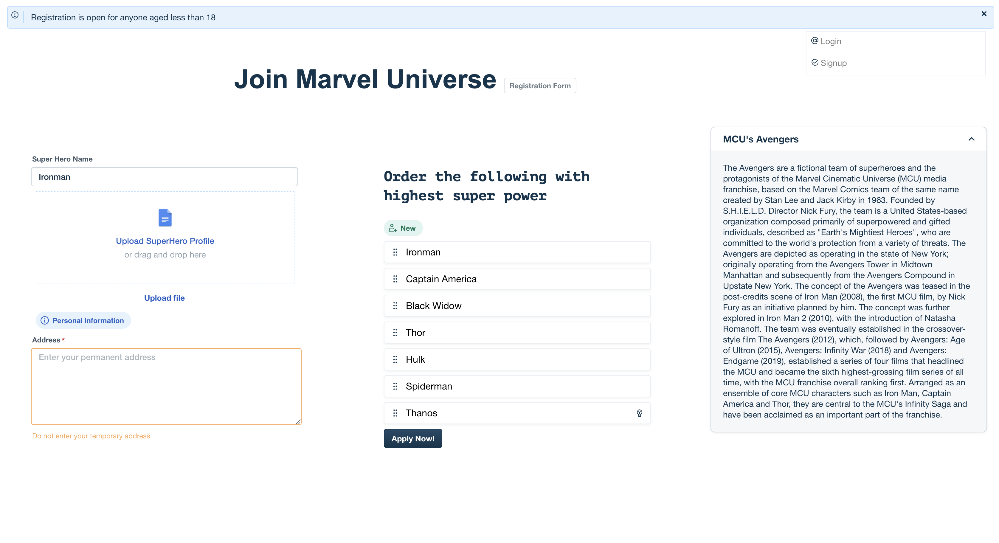

# Forms with Crayons



This is simple web app that demonstrates how to use crayons. The knowledge will help you become more productive focussing on the business logic as opposed to spending time and efforts to build UI componenets to match host Freshworks product.

```sh
# Clone the repository to your local
git clone git@github.com:freshworks-developers/crayons-samples.git

# move to `web/` directory
cd web/

# start a local server || ensure you have node.js v10+ installed
npx http-server

# Open the browser over the port generated :8080
# Navigate to `/events.html` or `/properties.html`
```
